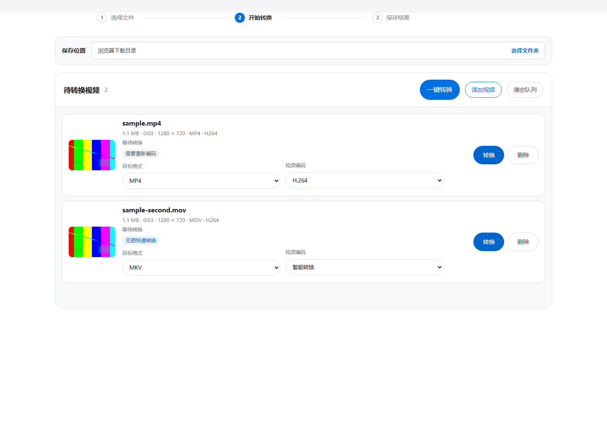
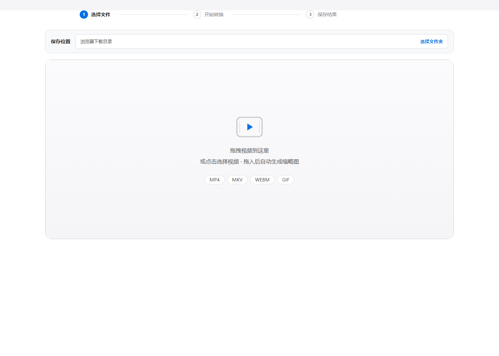

# Video Format Converter

> 离线桌面视频格式转换器 · Electron + FFmpeg 命令行 · 面试题实作项目



一个 Windows 桌面端视频格式转换工具：拖入视频即可看到**缩略图与完整媒体信息**，选择目标格式后由**智能转换策略**决定无损直拷还是重新编码——所有转换均通过 FFmpeg 命令行子进程完成，全程本地离线，不上传任何数据。

## 核心特性

### 1. 视频信息与缩略图预览

添加视频后自动解析并显示：时长、分辨率、帧率、总码率、容器格式、音视频编码，并截取约 10% 位置一帧生成缩略图（480px 宽，Lanczos 缩放）。



### 2. FFmpeg 命令行转换（不依赖 FFmpeg API）

所有探测、截帧、转换均通过子进程参数数组调用 FFmpeg 可执行文件，无任何 API/SDK 依赖。

| 目标容器 | 视频编码 | 音频编码 |
|---|---|---|
| **MP4** | H.264（CRF 23）/ H.265（CRF 28）/ AV1（SVT-AV1）/ 智能直拷 | AAC |
| **MKV** | H.264 / H.265 / AV1 / 智能直拷（任意源编码） | AAC |
| **WebM** | VP9（CRF 32） | Opus |
| **GIF** | 12fps · 宽度上限 720 · 调色板按帧差异生成（`palettegen stats_mode=diff`）+ sierra2_4a 抖动，减少闪烁与色带 | — |

支持输入：MP4 / MOV / MKV / WebM / AVI / M4V / WMV / FLV 等。

### 3. 智能转换（本项目核心优化）

编码选"auto"时，程序先探测源文件的容器与编码兼容性：

| 判定 | 结果 |
|---|---|
| 源编码与目标容器兼容（如 H.264 → MP4/MKV） | **无损直拷**（`-codec copy`）：不重编码、零画质损失、耗时约为重编码的 1/20 |
| 不兼容（如 H.264 → WebM）或源带透明通道 | 自动回退重新编码（H.264） |

转换完成后界面明确提示本次执行的**实际方式**（无损直拷 / 已转码为某编码）、耗时与输入输出编码。

固定样本实测（多次运行取中位数）：智能直拷对比 H.264 CRF 23 重编码，**速度提升 20.65 倍、耗时减少 95.16%**，SSIM 1.0（逐帧一致）。

## 快速开始

```powershell
npm install
npm run desktop
```

> 首次运行前需将 FFmpeg 可执行文件放置于 `bin/ffmpeg/ffmpeg.exe`（该目录不入库，可从 [FFmpeg 官网](https://ffmpeg.org/download.html) 获取 Windows 构建）。

命令行使用：

```powershell
node cli.js capabilities --json
node cli.js targets example.mp4 --json
node cli.js convert input.mov --to mp4 --output output.mp4 --json
node cli.js convert a.mp4 b.mkv --to webm --output-dir converted --json
node cli.js convert input.mp4 --to mp4 --video-codec h265 --json
```

## 运行测试

```powershell
npm test
```

覆盖视频边界（仅视频输入拒绝）、编码参数、媒体探测、转换队列、设置存储与 Electron 安全策略。

## 技术栈

| 层 | 选型 |
|---|---|
| 桌面壳 | Electron 43（`contextIsolation` / `sandbox` 全开） |
| 本地服务 | Express + Multer（127.0.0.1 同源信任） |
| 转换引擎 | FFmpeg 子进程（参数数组调用，30 分钟超时保护） |
| 前端 | 原生 HTML/CSS/JS，中英双语（zh-CN / en-US） |
| 测试 | Node.js 内置 test runner |

## 项目文档

| 文档 | 内容 |
|---|---|
| [docs/SUBMISSION_REPORT.md](docs/SUBMISSION_REPORT.md) | **提交报告**——面试题逐项交付状态、性能证据、已知限制 |
| [docs/UI_SHIPPED.md](docs/UI_SHIPPED.md) | **实装界面选择**——每个界面状态、设计决策与决策主体 |
| [会话总结.md](会话总结.md) | **AI 协作会话总结**——开发过程、12 项开发者决策与反馈记录 |
| [DESIGN.md](DESIGN.md) | 界面设计规范（Apple 风格令牌） |

## 许可

详见 [LICENSE](LICENSE)。
